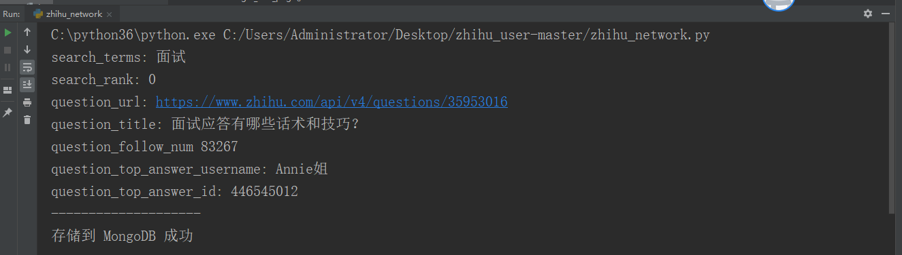
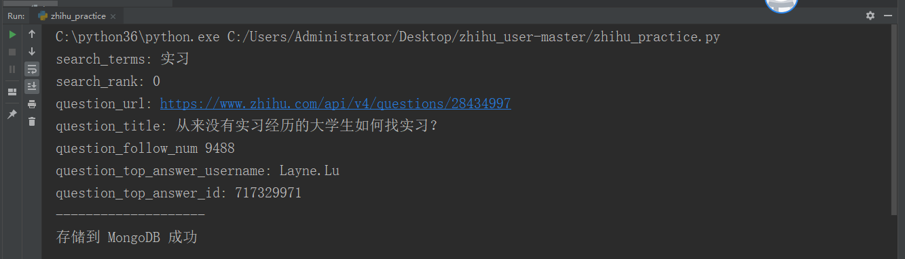
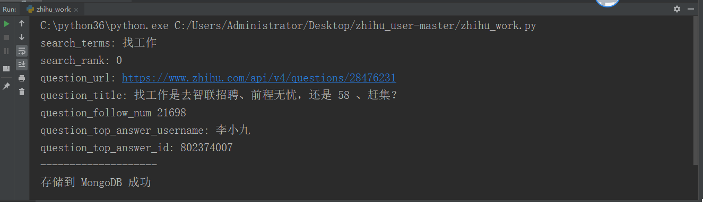
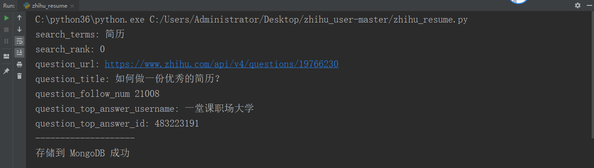
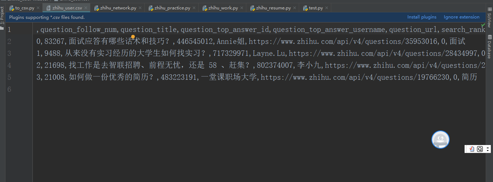
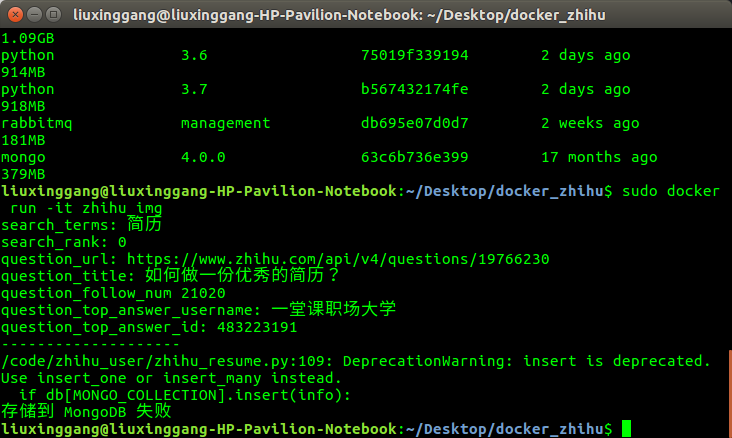

# zhihu_user
##### 所需环境的安装和配置：

###### 1.环境需求

python3+MongoDB+pandas+requests+pymongo

###### 2.安装步骤

- MongoDB安装，参考

  ```
  https://blog.csdn.net/bbc2005/article/details/87900841
  ```

- 安装pandas

  ```python
  pip install --index-url https://pypi.douban.com/simple pandas
  ```

- 安装pymongo

  ```python
  pip install --index-url https://pypi.douban.com/simple pymongo
  ```

- 安装requests

  ```python
  pip install --index-url https://pypi.douban.com/simple pymongo
  ```

###### 3.运行pycharm导入下载的项目，并运行相应的文件，其中

面试——zhihu_network.py

实习——zhihu_practice.py

找工作——zhihu_work.py

简历——zhihu_resume.py

MongoDB数据库导出数据csv文件——to_csv.py

###### 4.运行结果展示

面试


实习


找工作


简历


数据导出


已经在linux系统中将项目部署到docker,目前docker的MongoDB正在配置



